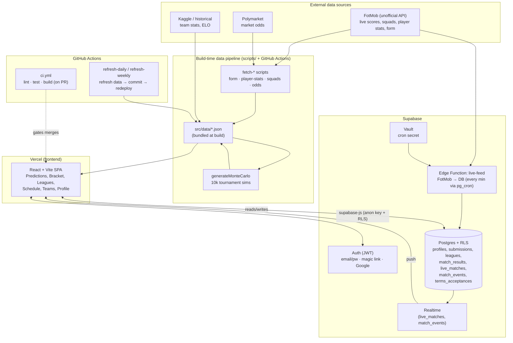

# Architecture — World Cup 2026 Predictor

A React SPA on Vercel, backed by Supabase (auth, Postgres + RLS, Realtime, Edge
Functions), with a data pipeline that pulls from FotMob and Polymarket and bakes
JSON into the build. This document is the map of how those pieces fit together.

## System diagram

## Components

### Frontend (`src/`)
- **React + Vite + Tailwind**, deployed to Vercel (auto-deploy on push to `main`).
- Reads two kinds of data:
  - **Static JSON** (`src/data/*.json`) — predictions model inputs, fixtures,
    ELO, squads, player stats, precomputed Monte Carlo. Bundled at build time, so
    refreshing them requires a rebuild/redeploy (handled by the refresh workflows).
  - **Live data** via `supabase-js` (anon key, gated by RLS) — auth, user
    submissions, leagues, leaderboard, and the live match feed over Realtime.
- Prediction model lives in `src/utils/Predictions.js` (logistic regression +
  squad-strength + recent-form blend) and `src/utils/TournamentSimulator.js`
  (Monte Carlo).

### Supabase
- **Auth** — email/password, magic link, Google OAuth. JWT sessions; expiry
  handled by Supabase.
- **Postgres + RLS** — every table has row-level security. Migrations in
  `supabase/migrations/` (numbered, run via SQL editor or `db push`).
- **Realtime** — `live_matches` and `match_events` are published so clients see
  goals/cards/subs without polling.
- **Edge Function `live-feed`** — Deno port of `scripts/fetchLiveFeed.mjs`,
  invoked every minute during match hours by `pg_cron` (migration `009`),
  authenticated with a shared secret stored in Vault.

### Data pipeline (`scripts/`)
- `fetchRecentForm`, `fetchPlayerStats`, `fetchFotmobSquads`, `buildSquadStrength`,
  `fetch_polymarket_odds`, `generateMonteCarlo` — produce the `src/data/*.json`
  the model consumes.
- Scheduled by `refresh-daily.yml` (form + sim) and `refresh-weekly.yml` (full
  squad/player refresh); each commits updated JSON, which triggers a Vercel
  redeploy.

### CI/CD
- **`ci.yml`** — lint (report-only), test, and production build on every PR.
- **`refresh-*.yml`** — scheduled data refresh.
- **Dependabot** — weekly npm + GitHub Actions updates.

## Key data flows

1. **Predictions (static):** scripts → `src/data/*.json` → bundled → model runs
   in-browser (MatchCard, Bracket).
2. **Live scores (dynamic):** `pg_cron` → `live-feed` edge function → FotMob →
   `live_matches`/`match_events` → Realtime → UI. Final scores also land in
   `match_results`, which feeds pick scoring.
3. **User picks:** browser → `supabase-js` → `submissions` (RLS-guarded;
   `protect_locked_picks` trigger prevents editing kicked-off matches).

## Trust boundaries
- The **anon key** is public (in the bundle) — all client access is constrained
  by **RLS**, not by key secrecy.
- The **service-role key** lives only in the edge function and CI secrets, never
  in the frontend.
- The **FotMob API is unofficial** — the poller/scrapers are the single point to
  fix if its shape changes; the DB schema and UI are source-agnostic.

## Known gaps (see the engineering-hardening backlog)
Load/stress/resilience testing, formal DR/RPO, key-rotation runbook, and
regulatory (GDPR/CCPA) review are tracked but not yet implemented — several
require infrastructure or legal input rather than code.
